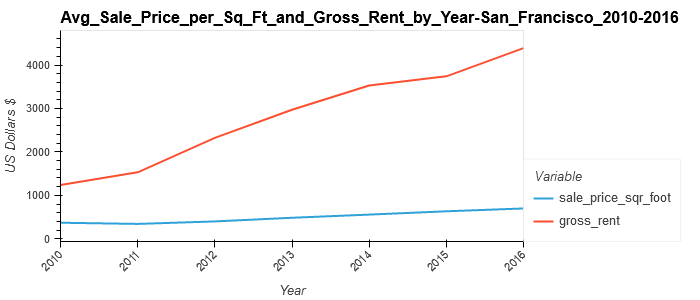

# 06_Proptech
**Jupyter notebook analyzing housing rental market data with interactive visualizations using PyViz, Plotly, and the Mapbox API.**

---
## Technologies
- PyViz
- The Mapbox API

## Installation Instructions
### Create a new conda environment to avoid conflicts with other package installations:
```powershell
conda deactivate
```
```powershell
conda update conda
```
```powershell
conda create -n pyviz python=3.7 anaconda
```
```powershell
conda activate pyviz
```
### Install PyViz packages:
```powershell
conda install -c plotly plotly=4.13.
```
```powershell
conda install -c pyviz hvplot
```
- PyViz require NodeJS version >= 12
```powershell
conda install -c conda-forge nodejs=12
```
### Install required JupyterLab Dependencies:
```powershell
conda install -c conda-forge jupyterlab=2
```
```powershell
jupyter labextension install jupyterlab-plotly@4.13.0 --no-build
```
```powershell
jupyter labextension install @jupyter-widgets/jupyterlab-manager plotlywidget@4.13.0 --no-build
```
```powershell
jupyter labextension install @pyviz/jupyterlab_pyviz --no-build
```
```powershell
jupyter lab build
```
### Install python-dotenv
```powershell
pip install python-dotenv
```

---
## Examples



---
## Contributors
Starter code was given in the Rice FinTech Bootcamp and all modifications were made by Remy Dillenseger.

---
## License
This project is licensed under the MIT License.
[Click Here](https://github.com/rdillens/05_Financial_Planner/blob/main/LICENSE) for more information.